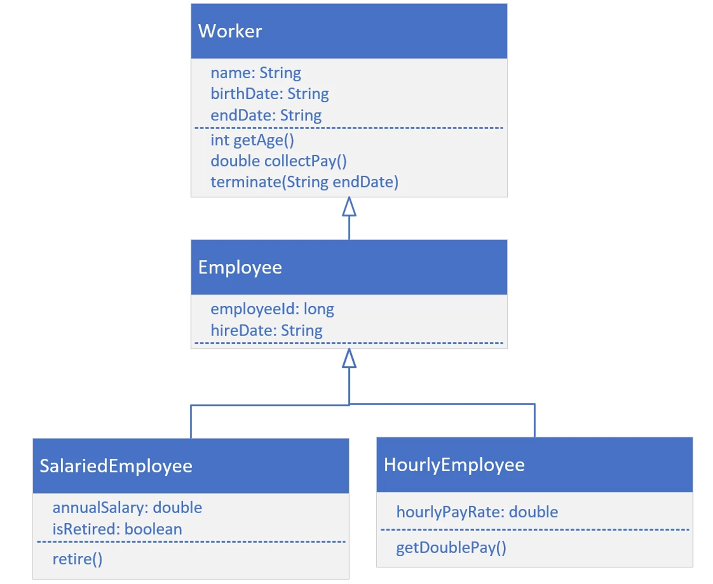

## Task 1.
Your task is to create the Worker class, the Employee class, and either the SalariedEmployee, or the HourlyEmployee class.
For each class, create the attributes and methods shown on this diagram.
Create a main method that will create either a SalariedEmployee or HourlyEmployee, and call the methods, getAge, collectPay, and the method shown for the specific type of class you decide to implement.

## Task 2

Create a program in Java that simulates a car rental agency. The program should have the following classes:

Car: This class should have fields for the car's make, model, year, and rental price per day.

Customer: This class should have fields for the customer's name and driver's license number.

Rental: This class should have fields for the rented car, the renting customer, the rental start date, and the rental end date. It should also have methods to calculate the rental price based on the number of rental days and to display the rental details.

Make sure to demonstrate the use of objects and classes in your implementation, including instance variables, constructors, and methods.

## TASK 3
Suppose you are working on a project to develop a game that includes a Player class. The Player class should have the following attributes:

name (String)
level (int)
healthPoints (int)
manaPoints (int)
In addition, the Player class should have the following methods:

getName(): returns the name of the player
getLevel(): returns the level of the player
getHealthPoints(): returns the current health points of the player
getManaPoints(): returns the current mana points of the player
setName(String name): sets the name of the player
setLevel(int level): sets the level of the player
setHealthPoints(int healthPoints): sets the current health points of the player
setManaPoints(int manaPoints): sets the current mana points of the player
The Player class should also ensure that the level, healthPoints, and manaPoints are valid values, meaning:

the level should be between 1 and 100
the healthPoints and manaPoints should be between 0 and 1000
Your task is to create a Player class that encapsulates the attributes and methods described above.

## TASK 4
Create a class named BankAccount that encapsulates the following attributes:

* accountNumber (String)
* balance (double)
* accountType (String)
* accountHolderName (String)
* The BankAccount class should have the following methods:

* getAccountNumber(): returns the account number of the bank account
* getBalance(): returns the balance of the bank account
* getAccountType(): returns the account type of the bank account
* getAccountHolderName(): returns the account holder name of the bank account
* deposit(double amount): deposits the specified amount into the bank account
* withdraw(double amount): withdraws the specified amount from the bank account

The deposit() method should update the balance of the bank account by adding the specified amount to the current balance. The withdraw() method should update the balance of the bank account by subtracting the specified amount from the current balance, as long as the resulting balance is not negative. If the resulting balance would be negative, the withdraw() method should not modify the balance and should instead throw an InsufficientFundsException.

The BankAccount class should ensure that the accountNumber, balance, accountType, and accountHolderName attributes are valid values, meaning:

* The accountNumber should be a string of 10 digits.
* The balance should be non-negative.
* The accountType should be "checking" or "savings".
* The accountHolderName should be a non-empty string.

Your task is to create the BankAccount class with the required attributes and methods, and to ensure that the attributes are encapsulated and validated according to the requirements above.

# Task 5
Write a math quiz game in Java, where the player is asked to answer a series of 10 addition questions. The questions are randomly generated with two numbers between 0 and 100. The player enters their answer for each question, and the game checks if the answer is correct. At the end of the game, the player is given their score, which is the number of questions they answered correctly out of the 10 questions asked.

Output: 

    Welcome to the Math Game!
    You will be asked 10 addition questions.
    1) 33 + 74 = 11
       Incorrect. The correct answer is 107
    2) 31 + 91 = 21
       Incorrect. The correct answer is 122
    3) 22 + 83 = 23
       Incorrect. The correct answer is 105
    4) 19 + 21 = 
        ...................................
    9) 100 + 77 = 177
    Correct!
    10) 74 + 65 = 2
    Incorrect. The correct answer is 139
    Game over. You answered 4 out of 10 questions correctly.

# TASK 6
This game is a guessing game where the player has to guess a number between 1 and 50 in 5 attempts. The game generates a random secret number, and the player has to guess it. If the player guesses the number correctly, the game ends and congratulates the player. If the player's guess is incorrect, the game gives them a clue about whether the secret number is higher or lower than their guess, and they get another chance to guess. If the player doesn't guess the secret number within the 5 attempts, the game ends and reveals the secret number.

Output:

    Welcome to the Guessing Game!
    I'm thinking of a number between 1 and 50.
    You have 5 guesses to find it.
    Guess #1: 5
    Incorrect. Here's a clue:
    The secret number is higher than 5.
    Guess #2: 12
    Incorrect. Here's a clue:
    The secret number is higher than 12.
    Guess #3: 42
    Incorrect. Here's a clue:
    The secret number is lower than 42.
    Guess #4: 14
    Incorrect. Here's a clue:
    The secret number is higher than 14.
    Guess #5: 52
    Incorrect. Here's a clue:
    The secret number is lower than 52.
    Sorry, you didn't guess the secret number. It was 37.

# TASK 7
Rock Paper Scissors is a simple two-player game that's often used as a way to settle disputes or make decisions. In the game, each player chooses one of three possible moves: rock, paper, or scissors. The rules of the game are simple:

* Rock beats scissors (rock crushes scissors)
* Scissors beat paper (scissors cut paper)
* Paper beats rock (paper covers rock)
* If both players choose the same move, it's a tie and the game is played again.

To implement this game, you can start by creating a RockPaperScissorsGame class that encapsulates the game logic. The class could have instance variables for the current player's move, the computer's move, and the current score for each player.

You can then create a play method that runs the game loop. In each iteration of the loop, you prompt the user to enter their move and generate a random move for the computer. You then compare the moves to determine the winner and update the scores accordingly. Finally, you check if one player has reached the winning score (e.g., 3) and declare them the winner if so.

Here's a rough outline of the RockPaperScissorsGame class:

    import java.util.Scanner;

    public class RockPaperScissorsGame {
        private int playerScore;
        private int computerScore;
    
        public RockPaperScissorsGame() {
            // Constructor that initializes scores to 0
        }
    
        public void play() {
            Scanner sc = new Scanner(System.in);
    
            while (true) {
                // Prompt the user for their move
                // Generate a random move for the computer
                // Compare the moves to determine the winner
                // Update the scores accordingly
                // Check if a player has reached the winning score and declare them the winner if so
            }
        }
    }

To make the game more interesting, you could add features such as:

* A way for the user to choose how many rounds to play
* A way for the user to enter their name and display it in the game
* A way to keep track of and display the history of moves and scores for each player

Output:

    Welcome to Rock Paper Scissors!
    Choose your move:
    1. Rock
    2. Paper
    3. Scissors
       Enter your move: 3
       Computer chooses: Paper
       You win this round!
       Your score: 1
       Computer's score: 0
       Enter your move: 1
       Computer chooses: Scissors
       You win this round!
       Your score: 2
       Computer's score: 0
       Enter your move: 1
       Computer chooses: Paper
       Computer wins this round.
       Your score: 2
       Computer's score: 1
       Enter your move: 2
       Computer chooses: Scissors
       Computer wins this round.
       Your score: 2
       Computer's score: 2
       Enter your move: 1
       Computer chooses: Rock
       This round is a tie.
       Your score: 2
       Computer's score: 2
       Enter your move: 1
       Computer chooses: Scissors
       You win this round!
       Your score: 3
       Computer's score: 2
       Congratulations, you win the game!

## Task 8

LeetCode sualları

1. https://leetcode.com/problems/palindrome-number/
2. https://leetcode.com/problems/valid-parentheses/
3. https://leetcode.com/problems/power-of-twoe